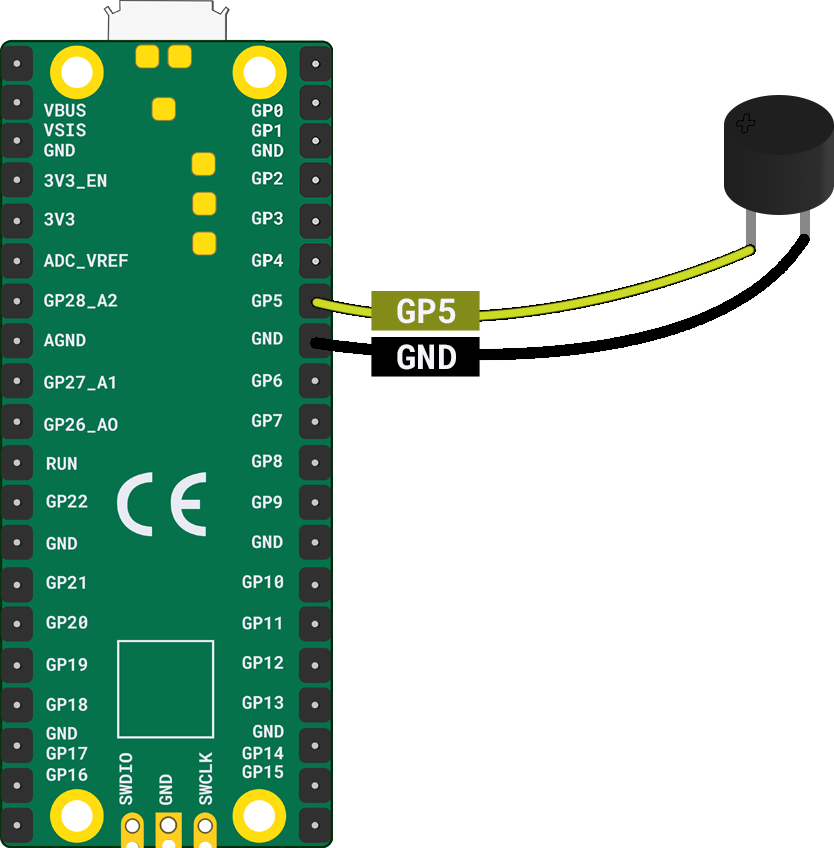

## Passive Buzzers

There are two main types of buzzer, an **active** buzzer and a **passive** buzzer. An **active** buzzer always plays the same tone. A **passive** buzzer can play a variety of tones. It requires a connection to be made and a specific signal to play the chosen tone.

[[[buzzers-speakers]]]

Some passive buzzers can be connected without worrying about which pin is connected to ground, and which pin is connected to a GPIO pin on the Raspberry Pi Pico. Others have to be connected in a specific way and will normally have a **+** symbol on the surface, to tell you which pin needs connecting to the GPIO signal pin

Here is how you could wire your buzzers to a Raspberry Pi Pico:

[[[single-buzzer-wire]]]
[[[stereo-buzzer-wiring]]]
[[[earphones-wiring]]]

Set up your buzzer in your code:

[[[single-buzzer-pin]]]
[[[multiple-buzzer-pins]]]

Humans can hear sounds in the range 20 Hz (very low) to 20,000 Hz (very high). Children and young people can hear higher sounds than older people. Musical notes correspond to specific sound **frequencies**, for example the middle C (C4) is about 523 Hz. Hz, short for Hertz, is the number of vibrations per second. Sending the right signal to a buzzer will make it vibrate at a particular frequency which you will hear as a musical note.

There are many things you can do with buzzers, here is some useful information and a couple of ideas:

[[[list-of-notes]]]

[[[note-length]]]

[[[frequency-numbers]]] 

[[[sheet-to-notes]]]

[[[play-single-note]]]

[[[play-a-tune]]]

[[[notes-in-loop]]]

[[[pico-sound-frequency]]]

[[[whitenoise-drum-beat]]]

[[[interrupt-tune]]]

[[[sharing-a-ground-pin]]]
