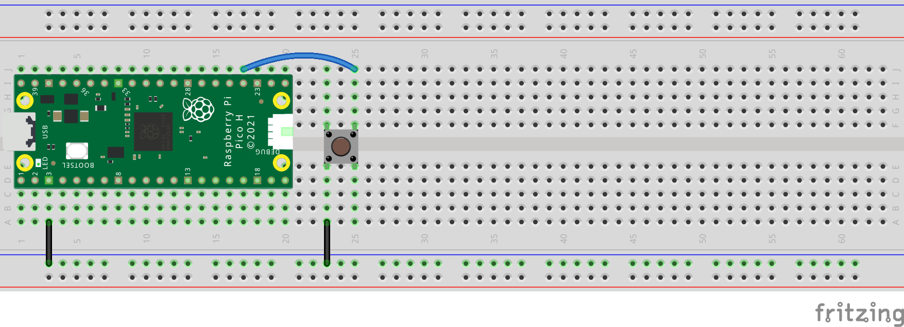
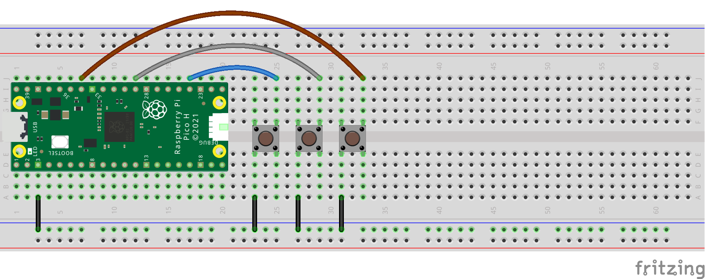

## Buttons and switches

The Raspberry Pi Pico can detect when an input is connected between GND and one of the GP pins.

A switch is a an electrical component that can be **closed** to allow electrical current to flow and **open** to prevent electrical current from flowing. A button is a kind of momentary switch that makes a connection only when it is **pressed**. 

 

The simplest kind of switch is two jumper wires that can be connected together to close the switch, or separated to open the switch. The most common type of button is a Push Button Switch but there are many types of buttons and switches that can be bought or crafted.

Here is how to wire a button to a Raspberry Pi Pico on a breadboard:

Set up your button  in your code:

[[[single-button-pins]]]

You can use a function to be called when a button is pressed.

--- collapse ---

---
title: Call a function when a button is pressed
---

Here you can create a function that will turn on the onboard LED for 1 second when the button is pressed.

--- code ---
---
language: python
---
from picozero import Button, pico_led
from time import sleep

button = Button(10)

def flash():
    pico_led.on()
    sleep(0.5)
    pico_led.off()

button_1.when_pressed = flash

--- /code ---

--- /collapse ---

Just as with the other components, you can wire up more than one:

There are many things you can do with buttons, here are a couple of ideas:

--- collapse ---

---
title: Call a different function when each button is pressed
---

You can have multiple buttons that each call a different function when they are pressed. 

Make sure you use the function names from your project and just use the name of the function, do not call it by adding brackets.

--- code ---
---
language: python
---

button_1.when_pressed = function_1
button_2.when_pressed = function_2
button_3.when_pressed = function_3

--- /code ---

--- /collapse ---

--- collapse ---

---
title: Change to the next function when a single button is pressed
---

Use an `option` variable to keep track of the current function so that you can decide which function to call next. 

--- code ---
---
language: python
---
option = 0 # store the current option

def choice(): # call the next function and update the option
    global option
    if option == 0:
        rgb.color = (255, 0, 0) 
    elif option == 1:
        rgb.color = (0, 255, 0)     
    elif option == 2:
        rgb.color = (0, 0, 255)   
    elif option == 3:    
        rgb.off()
    
    # move to the next option
    if option == 3:
        option = 0
    else:
        option = option + 1
    
button.when_pressed = choice # Call the choice function when the button is pressed

--- /code ---

--- /collapse ---

