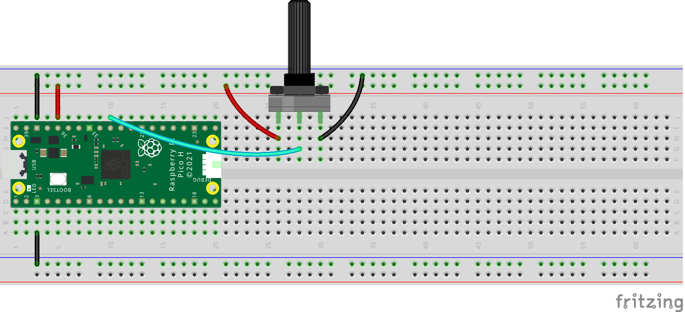
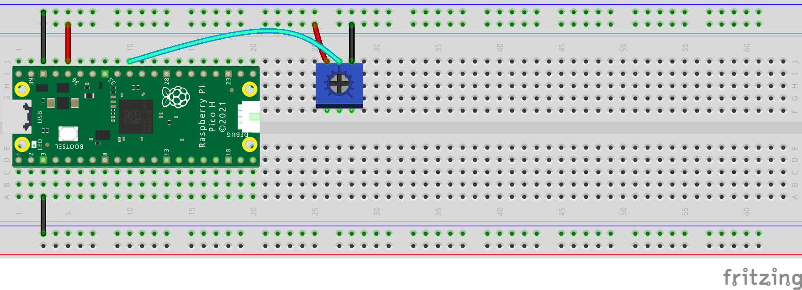

## Potentiometers

A potentiometer is a resistor that allows you to change the value of the resistance. They are often just called **pots** and theey come if a few different shapes and sizes.

Turning the dial on the top of the potentiometer will change the resistance of the potentiometer, which can then be read by the Raspberry Pi Pico.

A potentiometer has three pins. The outer pins are normally connected to a 3V3 pin and a GND pin. The middle pin is connected to a GPIO pin capable of reading an analogue signal:

{:width="300px"}

Here are two examples of how to wire a potentiometer to a Raspberry Pi Pico using a breadboard:

Set up your potentiometer in your code:

[[[potentiometer-pin]]]

The Thonny plotter allows you to display the values so you can see the effect of turning the dial. In Thonny, choose 'View > Plotter' and the plotter will appear next to the Shell.

The following code will read a value from the potentiometer and print out the result:

--- code ---
---
language: python
filename: 
line_numbers: true
line_number_start: 1
line_highlights: 
---
from picozero import Pot # Pot is short for Potentiometer
from time import sleep

dial = Pot(0) # Connected to pin A0 (GP_26)

while True:
    print(dial.value)
    sleep(0.1) # slow down the output

--- /code ---

The `sleep(0.1)` line slows down the reading and printing of values from the potentiometer so that Thonny can keep up with the output. 

The value should be 0 (or close to 0) when the potentiometer is turned all the way to the left and 1 (or close to 1) when it is turned all the way to the right. If your values are the wrong way round you need to swap the jumper wires connected to GND and 3V3.

There are many things you can do with a potentiometer, here are a couple of ideas:

--- collapse ---

---
title: Call a function based on the value of the potentiometer
---

If you are using a potentiometer to control outputs then you will need to divide up the dial into equal sections. 

You can use `dial.percent` to get a value between 0 and 1 from the potentiometer. If you have 5 sections then you can check whether the value is less than 20, 40, 60, 80 or 100. If you have 3 sections then you can check whether the value is less that 33, 66 or 100. 

--- code ---
---
language: python
---

while True:
    function_to_call = dial.percent
    print(function_to_call)
    if function_to_call < 20:
        function_1()
    elif function_to_call < 40:
        function_2()
    elif function_to_call < 60:
        function_3()
    elif function_to_call < 80:
        function_4()
    else:
        function_5()
    sleep(0.1) 

--- /code ---

--- /collapse ---

--- collapse ---

---
title: Change the speed of a tune using a potentiometer
---

You can use a potentiometer to control the speed of a tune when the tune is playing: 

--- code ---
---
language: python
---
BEAT = 0.4

liten_mus = [ ['d5', BEAT / 2], ['d#5', BEAT / 2], ['f5', BEAT], ['d6', BEAT], ['a#5', BEAT], ['d5', BEAT],  
              ['f5', BEAT], ['d#5', BEAT], ['d#5', BEAT], ['c5', BEAT / 2],['d5', BEAT / 2], ['d#5', BEAT], 
              ['c6', BEAT], ['a5', BEAT], ['d5', BEAT], ['g5', BEAT], ['f5', BEAT], ['f5', BEAT], ['d5', BEAT / 2],
              ['d#5', BEAT / 2], ['f5', BEAT], ['g5', BEAT], ['a5', BEAT], ['a#5', BEAT], ['a5', BEAT], ['g5', BEAT],
              ['g5', BEAT], ['', BEAT / 2], ['a#5', BEAT / 2], ['c6', BEAT / 2], ['d6', BEAT / 2], ['c6', BEAT / 2],
              ['a#5', BEAT / 2], ['a5', BEAT / 2], ['g5', BEAT / 2], ['a5', BEAT / 2], ['a#5', BEAT / 2], ['c6', BEAT],
              ['f5', BEAT], ['f5', BEAT], ['f5', BEAT / 2], ['d#5', BEAT / 2], ['d5', BEAT], ['f5', BEAT], ['d6', BEAT],
              ['d6', BEAT / 2], ['c6', BEAT / 2], ['b5', BEAT], ['g5', BEAT], ['g5', BEAT], ['c6', BEAT / 2],
              ['a#5', BEAT / 2], ['a5', BEAT], ['f5', BEAT], ['d6', BEAT], ['a5', BEAT], ['a#5', BEAT * 1.5]]

for note in liten_mus:
        speaker.play(note) 
        sleep(dial.value) # leave a gap between notes depending on potentiometer value

--- /code ---

--- /collapse ---