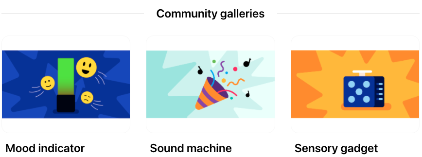

## Our Raspberry Pi Pico projects

Our beginner level [Introduction to Raspberry Pi Pico](https://projects.raspberrypi.org/en/pathways/pico-intro) path has six projects to introduce digital making with the Raspberry Pi Pico. 

In the path you will learn how to connect and control LEDs, buttons, switches, buzzers and potentiometers. You will make: 
+ An LED firefly
+ A party popper
+ Beating heart
+ Mood indicator
+ Sound machine
+ Sensory gadget

**Get inspired:** take a look at our [Community galleries](https://wakelet.com/@Intro_to_Pico){:target="_blank"} to see the types of things you will be able to make when you complete our [Introduction to Raspberry Pi Pico](https://projects.raspberrypi.org/en/pathways/pico-intro) path. 

