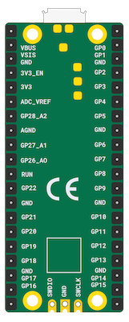
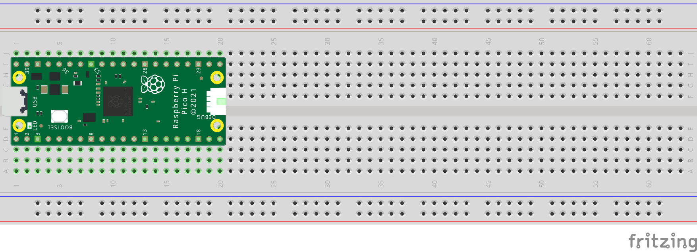
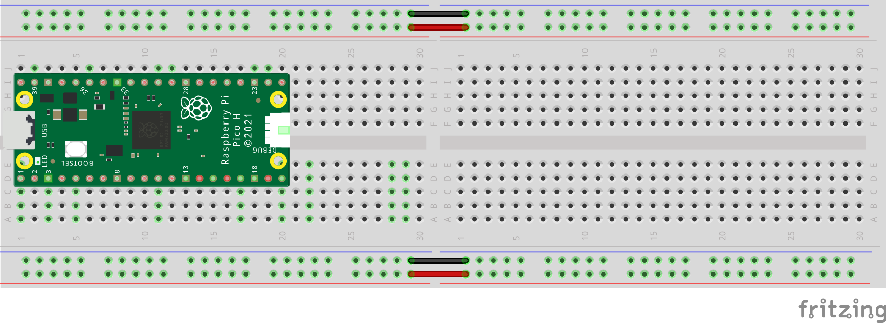

## Meet Raspberry Pi Pico

This is a Raspberry Pi Pico. Hopefully your device has already had the header pins soldered on, but if not, you might like to have a look at our [Getting started with soldering resource](https://projects.raspberrypi.org/en/projects/getting-started-with-soldering).

--- task ---
 
Plug your micro USB cable into the port on the left-hand side of the board.

--- /task ---

A Raspberry Pi Pico has 40 pins on its board. Pins allow you to connect external components to the Raspberry Pi Pico.

If you need to know the pin numbers for a Raspberry Pi Pico, you can refer to the following diagram that shows the underneath side of the Raspberry Pi Pico.

The [Introduction to Raspberry Pi Pico](https://projects.raspberrypi.org/en/pathways/pico-intro) path uses jumper wires to connect electronic component directly to the Raspberry Pi Pico, with resistors as needed. 

[[[pin-socket-jumper-wires]]]

One of the easiest ways to connect electronic components to a Raspberry Pi Pico is using a breadboard.Not to be confused with the objects often found in kitchens for use wheen slicing loaves,  electronic breadboards allow you to create temporary connections between components with the need to use solder or fiddly tape. This makes it easy swap things in and out quickly if you need to revise or correct something.

A Raspberry Pi Pico with soldered headers fits nicely into a Half+ sized breadboard, although there isn't much room for building large circuits in the remaining space. For this reason, a Full size breadboard may be better. 

Most half-sized breadboards can be connected together, but remember that thee two sets of edge rails will not be automatically connected, so you should do this using jumper wires. 

