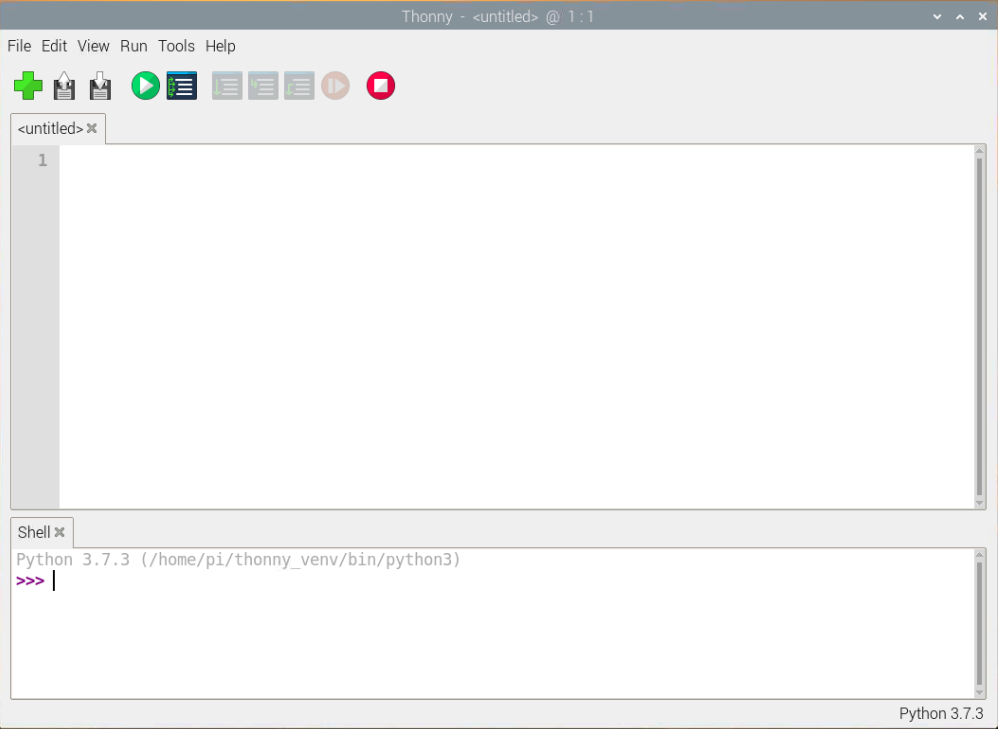

## Install Thonny

In this step, you will install Thonny or make sure you have the latest version. Then you will connect to a Raspberry Pi Pico and run some simple Python code using the Shell. 

Note: If you are completing this project in a school or other setting with a managed network, then you should make sure that you have the appropriate permissions to mount a USB drive and install software.

--- task ---

The Thonny Python editor can be installed on a Linux, Windows or Mac computer.

[[[thonny-install]]]

[[[change-theme-thonny]]]

--- /task ---

--- task ---

Open Thonny from your application launcher. It should look something like this:

--- /task ---

