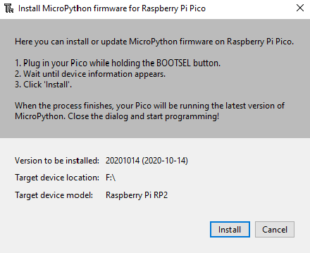
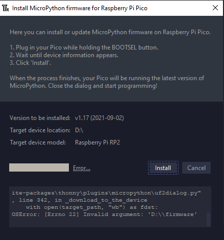
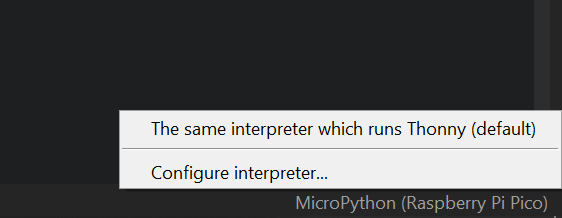

## Add the MicroPython firmware

If you have never used MicroPython on your Raspberry Pi Pico, you will need to add the MicroPython firmware. 

[[[add-micropython-firmware]]]
[[[firmware-installation-menu]]]

--- task ---

Look at the text in the bottom right of the Thonny editor. It will show you the version of Python that is being used.

If it does not say 'MicroPython (Raspberry Pi Pico)' then click on the text and select 'MicroPython (Raspberry Pi Pico)'.

If you have never used MicroPython on your Raspberry Pi Pico, then Thonny will prompt you to add the MicroPython firmware. Click install. 

--- /task ---

--- task ---

**Debug:** 

--- collapse ---
---
title: There was an error installing the firmware
---
If you see an error message during install then:
+ disconnect your Raspberry Pi Pico
+ reconnect your Raspberry Pi Pico
+ try installing the firmware again (you might need to press the stop button first)

--- /collapse ---

--- collapse ---

---
title: I don't know if firmware is installed and cannot connect to my Pico
---

Make sure your Raspberry Pi Pico is connected to your computer with a microUSB cable. Click on the list in the bottom right of your Thonny window. A popup menu will appear listing the available interpreters. 

 

If you cannot see the Pico in the list (like in the picture), you will need to reconnect your Raspberry Pi Pico while holding the BOOTSEL button to mount it as a storage volume and reinstall the firmware by following the instructions in the collapse above.

--- /collapse ---

--- collapse ---

---
title: Firmware is installed but I still cannot connect to my Pico
---

You may be using the wrong kind of microUSB cable. Your current microUSB cable may be damaged, or designed only to carry power to devices and cannot transfer data. Try swapping your cable if nothing else has worked. 

If your Pico still won't connect after trying all these things, it may *itself* be damaged and unable to connect. 

--- /collapse ---

You can find further information in the [Raspberry Pi Pico Guide](https://projects.raspberrypi.org/en/projects/introduction-to-the-pico){:target="_blank"}.

--- /task ---

**Tip:** To update to the latest MicroPython firmware, click on 'MicroPython (Raspberry Pi Pico)' at the bottom of the Thonny window and choose 'Configure interpreter...'. Follow the instructions to update MicroPython.