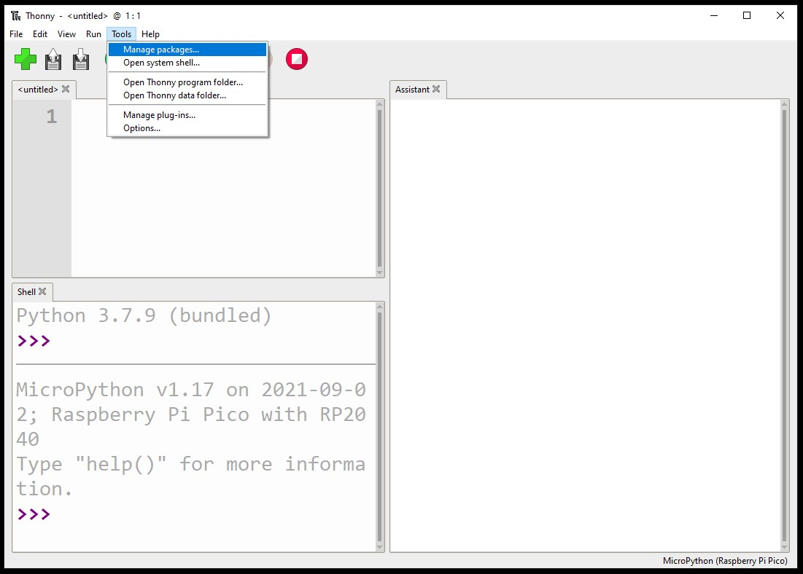

## Install the picozero library

`picozero` is a MicroPython library for beginners to the Raspberry Pi Pico. If it is not already installed on your Raspberry Pi Pico, follow the steps below. 

--- task ---

To complete the projects in this path, you will need to install the picozero library as a Thonny package.

In Thonny, choose 'Tools > Manage packages...'.

--- /task ---

--- task ---

In the pop-up 'Manage packages for Raspberry Pi Pico' window, type `picozero` and click 'Search on PyPi'.

--- /task ---

--- task ---

Click on 'picozero' in the search results. 

Click on 'Install'.

When installation has completed, close the package window then exit and reopen Thonny.

--- /task ---

If you have difficulties installing the `picozero` library in Thonny, you can download the library file and save it to your Raspberry Pi Pico. 

[[[picozero-offline-install]]]

