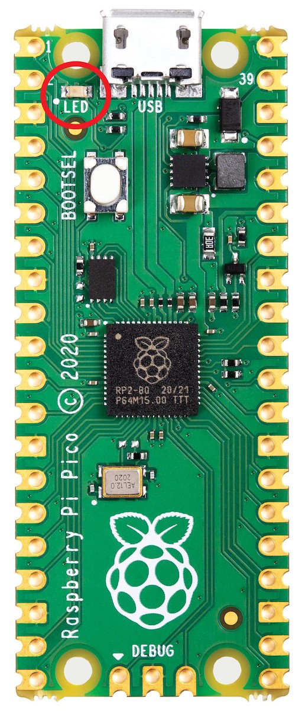
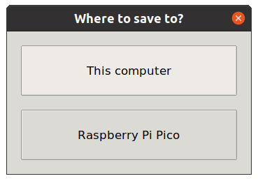
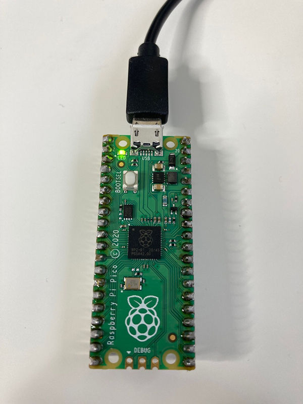
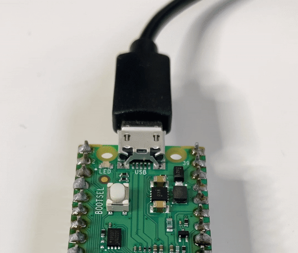

## Write a program

In this step, you will run some simple Python code on your Raspberry Pi Pico.

### Use the Thonny Shell

--- task ---

Make sure that your Raspberry Pi Pico is connected to your computer and you have selected the MicroPython (Raspberry Pi Pico) interpreter.

--- /task ---

--- task ---

Look at the Shell panel at the bottom of the Thonny editor. 

You should see something like this:

--- /task ---

--- task ---

Look at your Raspberry Pi Pico and find the small LED next to the USB connector. 

{:width="200px"}

--- /task ---

--- task ---

Create a new file in Thonny by clicking 'File > New' in the top menu bar. An empty workspace should open.

--- /task ---

--- task ---

Type the following code into the main editor pane in Thonny:

--- code ---
---
language: python
filename: 
line_numbers: false
line_number_start: 
line_highlights: 
---
from picozero import pico_led 

pico_led.on()

--- /code ---

--- /task ---

--- task ---

Choose 'File->Save As'. Thonny will ask whether you want to save the file on **This computer** or the **Raspberry Pi Pico**. Choose **This computer** to save your code to your computer.  

Choose a location on your computer such as your 'Documents' folder. Name your file 'pico_led.py'.

--- /task ---

--- task ---

**Test:** Thonny has a green play button with a small white triangle inside it. Pressing this button allows you to run your code. 

+ Press the play button.  

+ Check that the small LED on the Raspberry Pi Pico turns on. 

{:width="300px"}

--- /task ---

--- task ---

**Debug:** 

--- collapse ---

---
title: The play button is faded out
---

If you don't see a green play button (it is faded):
+ click the red 'STOP' button
+ check that your Raspberry Pi Pico is connected to your computer with a USB cable
+ click on 'MicroPython (Raspberry Pi Pico)' at the bottom right of Thonny to reconnect
+ unplug your USB cable and then plug it back in

--- /collapse ---

--- collapse ---

---
title: Thonny says that there is an error in my code
---

Check your code very carefully and make sure it matches the example.

--- /collapse ---

--- collapse ---

---
title: There are no errors in my code but the light doesn't come on
---

Try a different USB cable, making sure that it is a **data** USB cable. As a last resort, try another Raspberry Pi Pico (if you have a spare).

--- /collapse ---

--- /task ---

The LED will stay on until you write code to turn it off or you unplug the Raspberry Pi Pico.

--- task ---

Import `sleep` to allow you to pause your code. Add code to the end of your script to sleep for one second and then turn the LED off. 

--- code ---
---
language: python
filename: pico_led.py
line_numbers: true
line_number_start: 1
line_highlights: 2,5-6
---
from picozero import pico_led
from time import sleep

pico_led.on()
sleep(1)
pico_led.off()
--- /code ---

--- /task ---

--- task ---

**Test:** Click the green play button. Thonny will save the file on your Raspberry Pi Pico and then run the new code. 

Check that the LED turns on and then goes off again. The LED will only light for one second so make sure you are watching.

Run your code as many times as you like. 

{:width="300px"}

**Debug:**

--- collapse ---

---
title: Thonny says sleep isn't defined
---

Add the `from time import sleep` line. 

--- /collapse ---

--- /task ---

You are now ready to start the [Introduction to Raspberry Pi Pico](https://projects.raspberrypi.org/en/pathways/pico-intro) path.