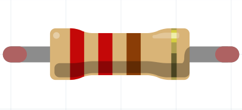
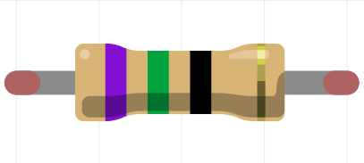

## Resistors

Resistors are used in circuits to reduce the flow of electrical current. Certain components, such as LEDs, can break or have a reduced lifetime if too much current flows through them. 

When using LEDs with a Raspberry Pi Pico, you should use a resistor of around 100Ω (say Ohms). Any resistor from 75Ω-220Ω will work.

Red&nbsp;Red&nbsp;Brown&nbsp;=&nbsp;2&nbsp;2&nbsp;1&nbsp;=&nbsp;2&nbsp;2&nbsp;x&nbsp;10 = 220Ω

Violet&nbsp;Green&nbsp;Black&nbsp;=&nbsp;7&nbsp;5&nbsp;1&nbsp;=&nbsp;7&nbsp;5&nbsp;x&nbsp;1 = 75Ω

[[[generic-physical-resistors]]]

