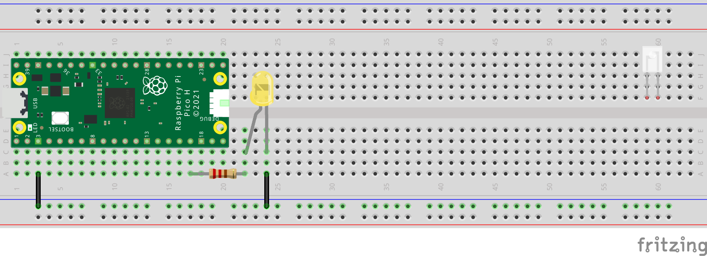
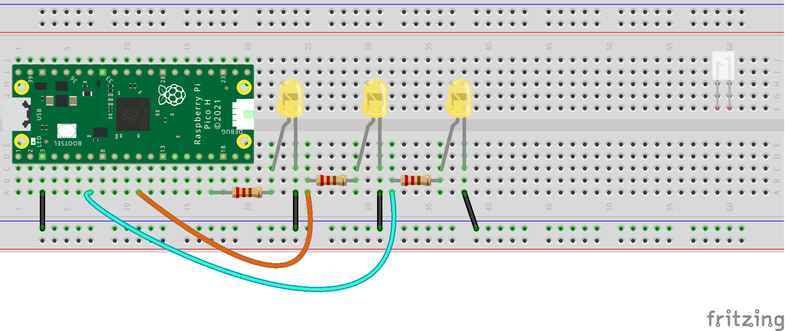

## LEDs

Light Emitting Diodes (LEDs) produce light when an electric current is passed through them. 

You can get many different colours of LEDs.

**Note:** An LED will only light up when electricity is passed through it in the correct direction, from the long leg (the anode) to the short leg (the cathode).

An LED will usually need a **resistor** to be used with it. This is because too much current can cause an LED to burn out, or even explode. If you bought your LEDs in a kit with the Raspberry Pi Pico then the correct resistors will have been included.

To get the maximum brightness from an LED, you need to find the correct resistor to use.

--- collapse ---

---
title: Calculate the correct resistor value for an LED
---

When you buy an LED, you can look at a datasheet for it, and find it's `forward voltage` and `forward current`.

| Parameter | Value |
|-----------|-------|
|**Forward voltage drop**|**2.1V**|
|Viewing angle|25 degrees
|**Max forward current**|**25 mA**|
|Luminous intensity|600 -1000 mCd (@20mA)|
|Lens types|Water Clear|

You also need to know your supply voltage, which for Raspberry Pi Pico will be 3.3V.

To know which resistor you need, you can use this calculation.

<math xmlns="&mathml;">
<mrow>
<mi>Needed Resistance</mi>
<mo>=</mo>
</mrow>
<mfrac>
<mrow>
  <mi>Supply Voltage</mi>
  <mo>-</mo>
  <mi>Forward Voltage of LED</mi>
</mrow>
  <mi>Forward Current of LED (in Amps, so divide by 1000)</mi>
</mfrac>
</math>
 
For instance, for the LED data above needs a resistor of at least 48Ω
 
<math xmlns="&mathml;">
<mrow>
<mi>Needed Resistance</mi>
<mo>=</mo>
</mrow>
<mfrac>
<mrow>
  <mi>3.3</mi>
  <mo>-</mo>
  <mi>2.1</mi>
</mrow>
  <mi>0.025</mi>
</mfrac>
</math>
 

--- /collapse ---

You can connect your LED to the Raspberry Pi Pico using a breadboard. The ground connection from the Raspberry Pi Pico is connected to the inner edge rail of the breadboard to make it easier to connect other parts of the circuit, in this case, the cathode legs of the LEDs. The other leg of thee LED (the anode) is connected to GPIO pin 13 through a resistor. If you use a different GPIO pin, you should change the number used in your Python program. }

Duplicate the same circuit on another pin to add more LEDs. 

Set up your LED in your code:

[[[sing-led-pins]]]

[[[multiple-single-led-pins]]]

To turn your LED on and then off again:

--- code ---
---
language: python
filename: main.py
line_numbers: false
line_number_start: 
line_highlights: 
---
from picozero import LED
from time import sleep

yellow = LED(13)
yellow.on()
sleep(2)
yellow.off()
--- /code ---

You can also use `blink`, `pulse` to create interesting effects:

[[[pico-led-blink-pulse]]]

LEDs can be bright to look at so it's a good idea to diffuse (spread out) the light:

[[[diffuse-leds]]]

[[[generic-theory-simple-colours]]]