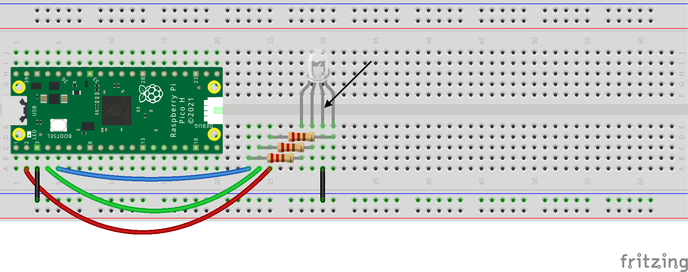

## RGB LEDs

RGB LEDs produce a range of colours by combining Red(R), Green(G) and Blue(B) light. 

RGB LEDs have 4 legs rather than two. Our projects **common cathode** RGB LEDs which means one leg needs connecting to a **GND** pin and the other three legs need connecting to **GPIO** pins.

There are also common anode RGBLEDs, which means that one leg needs connecting to a **3.3V** pin, and the other legs need connecting to **GPIO** pins.

With either type of RGB LED, a resistor is needed for each pin that is connected to a **GPIO** pin. The datasheet for an RGB LED will tell you the **forward current** and **forward voltage** for each colour on the LED, to help you calculate the resistor needed, although it is often easier just to use a fairly high value resistor on each of the legs, such as a 220Ω.

Here is how you can use a breadboard to an RGB LED to a Raspberry Pi Pico.

Note: You will need to use resistors with the three shorter legs of the RGB LED. The longer leg is for ground and doesn’t require a resistor (indicated by an arrow on the diagram below).

Look: Your RGB LED has four legs. Turn your RGB LED so that the longer GND leg is second from the left. Notice how the legs go R for red, then GND, then G for green and finally B for blue. This will help you remember what each leg is doing.

Set up your RGB LED in your code:

[[[rgb-led-pins]]]

RGB colours can be given using three numbers from 0-255, `(255, 0, 255)` is purple (maximum red and maximum blue). You may need to adjust the colours depending on how bright each of the three colours is for your LED. 

[[[generic-theory-simple-colours]]]

This code makes the LED change between different colours:

--- code ---
---
language: python
filename: main.py
line_numbers: false
line_number_start: 
line_highlights: 
---
from picozero import RGBLED
from time import sleep

rgb = RGBLED(red = 1, green = 2, blue = 3)

while True:
    rgb.color = (255, 0, 0)
    sleep(0.5)
    rgb.color = (0, 255, 0)
    sleep(0.5)
    rgb.color = (0, 0, 255)
    sleep(0.5)
--- /code ---

You can also use `blink`, `pulse` and `cycle` to create colour effects:

[[[pico-rgb-led-blink-pulse-cycle]]]

